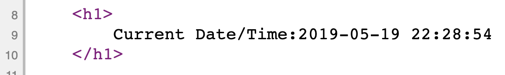
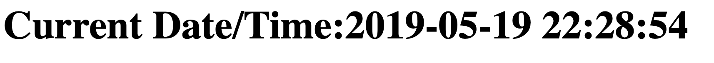
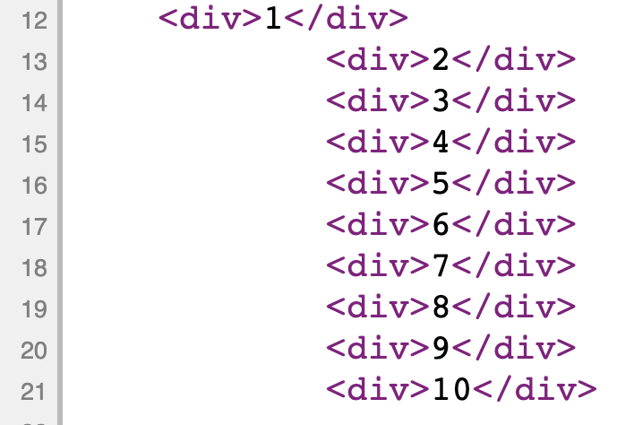
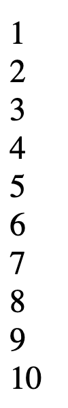

# PHP dom_elements

Introduction to PHP code - dom elements

### Before you begin

Check out a new branch from master for this exercise.  Then navigate to exercises/php_dom_elements directory in your terminal.

### Exercise

1. Dom elements only really exist in a browser.  Before they arrive at the browser, they are just strings
1. Put raw HTML into a php file, outside of php tags, and it will show up as regular elements in a rendered page
    * make an index.php file
    * add an h1 tag with "current date/time: " inside it.
    * load the page and see how the element shows up
1. You can have php tags anywhere inside the document
    * add a set of php tags, and inside those tags, get the current date and time
```php
<?php 
    $now = date('Y-m-d H:i:s');
?>
```
1. you can add PHP anywhere inside of regular HTML as long as it is inside php tags
1. variables in one set of php tags and see variables in any other php tags on the same page.  Just like JS variables in different script tags.
    * inside your h1 tag, after the "date/time: ", add a set of php tags
    * inside the php tags, put a print function call
        * print();
    * inside the print function argument, put the $now variable you made above
    * test the page, it should look like this:
        * html code: 
        * browser: 
1. You can switch in and out of php to make html with logic structures like if, for, while, etc
    * look up the [**'short open tag'**](https://php.net/manual/en/function.echo.php) in the echo function documentation
    * make a for loop in PHP to go from 1 to 10;
    * inside the for loop, put an exit php tag followed by an open tag
        * 
```php
<?php
    for($i = 0; ????){
        ?>
        <?php
    }
?>
```
#
* in between the close and open tag, make a regular html div
```
    ?>
        <div></div>
    <?php
```
#
* between the div tag, use the shortcut php tag
```
        <div> <?= ?> </div>
```
#
* inside the shortcut tag, put your variable $i
``` 
            <?= $i ?>
```
#
*  check for any errors, it should look something like this:
    * html code: 
    * browser: 
*  run your page
