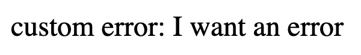
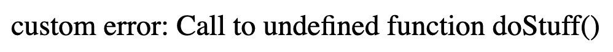
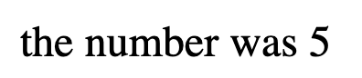

# PHP error handling

Introduction to PHP code - error handling

### Before you begin

Check out a new branch from master for this exercise.  Then navigate to exercises/error_handling directory in your terminal.
#### make a new branch named the same thing as the folder

### Exercise

1. create a file named index.php
1. Read about [**set_exception_handler**](https://www.php.net/manual/en/function.set-exception-handler.php)
1. In your index.php, create a function called error_handler
    * it takes in a single parameter, error
    * inside it will simply print the error out like this:
    ```php
    <?php 
        print( 'custom error: ' . $error->getMessage() );
    ?>
    ```
1. Again in your php file, after your function "error_handler", call the function "set_error_handler"
1. Pass the "error_handler" function, as a string, to the "set_exception_handler" function.
1. the error_handler function will now be called if any errors happen in the code when it runs.
1. Read about [**error exception throwing**](https://www.php.net/manual/en/language.exceptions.php)
1. in your code, using the link above, throw an exception with text of "I want an error".
1. Run the file, and see if you get the appropriate output of "I want an error" being printed.
    * example: 
1. Comment out the exception throwing code so we can give you feedback.
1. Put a call to a function called "doStuff".  Yes, I know there is no such function.
1. Run your code, and see that your custom error handler was called.  It should loook like this:
    * example: 
1. Comment out the doStuff function call.
1. Read about [**random numbers**](https://www.php.net/manual/en/function.rand.php) in PHP.
1. Set a variable, randomNumber, equal to a random number between 1 and 10
1. Put a conditional.  If the random number is odd, simply print the "The number was <number>" with the number you got.
1. if the random number is even, throw an exception "Exception: the number was even".
1. Test your putput, it should look like this:
    * odd number: 
    * even number: 
