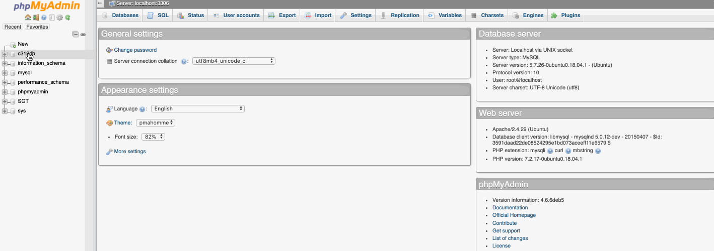
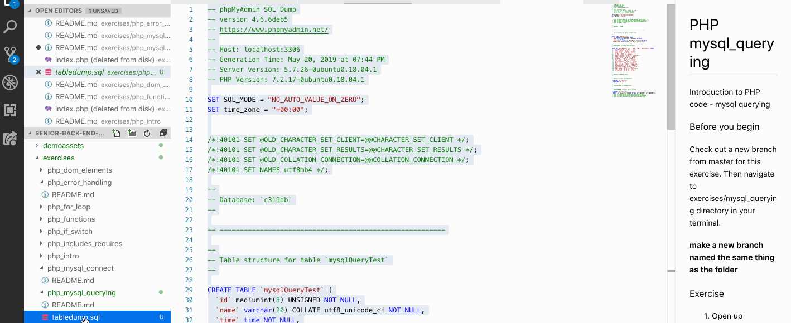
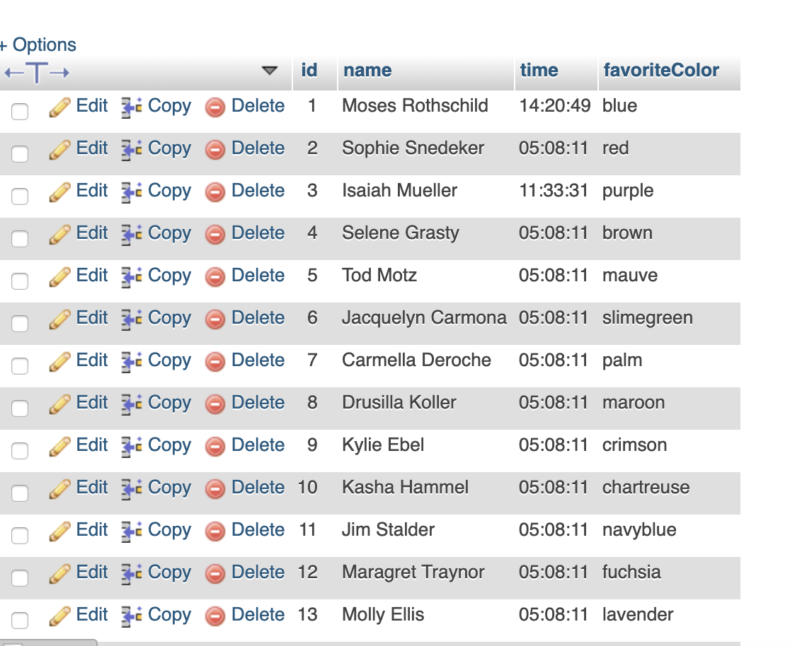
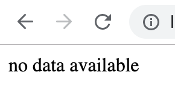
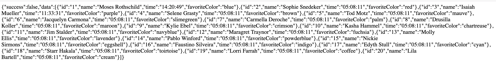
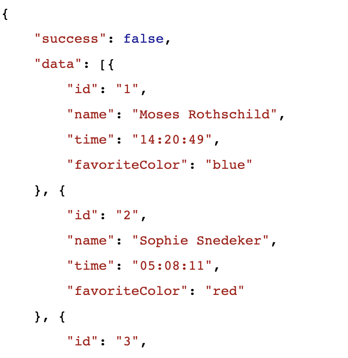

# PHP mysql_querying

Introduction to PHP code - mysql querying

### Before you begin

Check out a new branch from master for this exercise.  Then navigate to exercises/mysql_querying directory in your terminal.
#### make a new branch named the same thing as the folder

### Exercise

1. Open up phpmyadmin
1. go to your cohort database by selecting it on the left
1. click  on the SQL tab at the top
    * 
1. copy the contents of tabledump.sql in this database, and paste it into the SQL tab, and click "go"
    * 
1. recreate your mysql_credentials files from the previous prototype
    * mysql_credentials.php
    * mysql_credentials.config
    * .gitignore
1. in your mysql_credentials.php file, remote the truthy test to print the $conn variable.  We won't do that again.  You will need the falsey test
1. make a file, endpoint.php
1. In endpoint.php, require once your credential file to connect
1. in phpMyAdmin test write a query to select all information from the table you are going to draw data from
    * you should get something like this: 
1. create a variable, called query, and assign it a string
    * in that string, put the query you wrote in phpmyadmin
1. make a variable, called $result.  
1. assign it the result of the [**mysqli_query**](https://www.php.net/manual/en/mysqli.query.php) function (procedural, not oop)
    * give mysqli_query the variable that holds your connection as the first param
    * give mysqli_query the variable that holds your query
1. see if result is truthy or falsey
    * if it is falsey, print an error and use the function exit() to stop the code
        * to print an error for your mysqli query, take a look at [**mysqli_error**](https://www.php.net/manual/en/mysqli.error.php)
1. If you didn't get an error, intentionally get an error by misnaming the table
    * 
1. create an associative array, called $output
    * add a key of success, make it false
1. We need to determine if there was any data.  This is not always done, but useful many times.
    * create an if statement, 
    * use the function [**mysqli_num_rows**](https://www.php.net/manual/en/mysqli-result.num-rows.php) in the if statement
        * if( mysql_num_rows(???) )
    * mysqli_num_rows requires the result of the query, give mysqli_num_rows your result variable
    * test if the number of rows is 0
        * print "no data available" and exit
1. 
    * to test this, add "LIMIT 0" to the end of your query" to test with no data.
1. Now that we know we have data (we wouldn't be at this point if not), change the $output key of 'success' to true
1. add a key of 'data' to $output, and make it an array
1. create a while loop and use [**mysqli_fetch_assoc**](https://www.php.net/manual/en/mysqli-result.fetch-assoc.php).  Look for an example with a while loop
    * assign the while loop to a variable called $row, like in the example
    * use [**array_push**](https://www.php.net/manual/en/function.array-push.php) to add the $row variable to the $output['data'] property
1. json encode the $output variable and assign the string to $json_output
1. print $json_output
1. test your page, see if you got appropriate output
    * straight minified output 
    * prettified example put through jsonlint.com 

