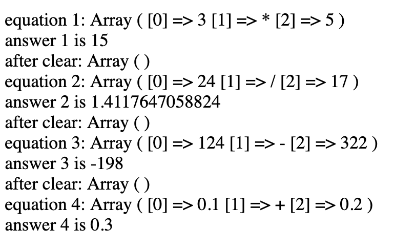

# PHP php receiving data

Introduction to PHP code - oop calc server

### Before you begin

Check out a new branch from master for this exercise.  Then navigate to exercises/php_oop_calc_server directory in your terminal.
#### make a new branch named the same thing as the folder

### Exercise

1. make a new gmail account for your server.  For example, I would make danielpaschalserver@gmail.com
1. create a file, sendmail.php (don't use caps in file names!)
1. create a file structure for configuration
    - a gmailcredentials.php
        - [**define a constant**](https://www.php.net/manual/en/function.constant.php) for your gmail address
        - constant for your gmail password
    - a gmailcredentials.php.config
        - the same structure as your gmailcredentials.php but with no sensitive data.  For example if your password was "fluffybunnies", you would put the password as "password"
    - a .gitignore
        - ignore your gmailcredentials.php
1. in sendmail.php, 
    1. import your gmailcredentials.php file, make sure to throw an error if it isn't loaded, and only load it once
    1. receive the following data via POST
        1. the EMAIL of the person contacting you 
        1. the NAME of the person contacting you
        1. the SUBJECT of the message to send
        1. the BODY of the message to send
```php
<?php

//Import PHPMailer classes into the global namespace
use PHPMailer\PHPMailer\PHPMailer;

require '../vendor/autoload.php';

//Create a new PHPMailer instance
$mail = new PHPMailer;

//Tell PHPMailer to use SMTP
$mail->isSMTP();

//Enable SMTP debugging
// 0 = off (for production use)
// 1 = client messages
// 2 = client and server messages
$mail->SMTPDebug = 2; /* CHANGE THIS TO 0 for production*/

//Set the hostname of the mail server
$mail->Host = 'smtp.gmail.com';
// use
// $mail->Host = gethostbyname('smtp.gmail.com');
// if your network does not support SMTP over IPv6

//Set the SMTP port number - 587 for authenticated TLS, a.k.a. RFC4409 SMTP submission
$mail->Port = 587;

//Set the encryption system to use - ssl (deprecated) or tls
$mail->SMTPSecure = 'tls';

//Whether to use SMTP authentication
$mail->SMTPAuth = true;

//Username to use for SMTP authentication - use full email address for gmail
$mail->Username = /* PUT YOUR EMAIL ADDRESS CONSTANT HERE*/;

//Password to use for SMTP authentication
$mail->Password = /* PUT YOUR EMAIL PASSWORD HERE*/;

//Set who the message is to be sent from
$mail->setFrom(/* put your gmail server email address here*/ , /* put your gmail server name here. you don't really have one, so make it easy to understand, for example: 'mailer daemon'*/);

//Set an alternative reply-to address
$mail->addReplyTo(/* add the user's email here so when you click "reply" in your email, you reply to them*/, /* put the user's name here*/);

//Set who the message is to be sent to
$mail->addAddress(/* PUT YOUR REGULAR GMAIL ACCOUNT HERE*/, /* PUT YOUR NAME HERE*/);

//Set the subject line
$mail->Subject = /* PUT THE SUBJECT HERE*/;

//Read an HTML message body from an external file, convert referenced images to embedded,
//convert HTML into a basic plain-text alternative body
/* make a message body here:*/
$HTMLbody = "
    <div>name: /*the name of the sender here*/ </div>
    <div>email: /*the email of the sender here*/</div>
    <div>subject: /*the subject of the message here*/</div>
    <div>ip address: /* use the $_SERVER superglobal to print the ip address of the client here*/</div>
    <div>message: /* the message body here */</div>
";
$textBody = "
    name: /*the name of the sender here*/ 
    email: /*the email of the sender here*/
    subject: /*the subject of the message here*/
    ip address: /* use the $_SERVER superglobal to print the ip address of the client here*/
    message: /* the message body here */
";
$mail->msgHTML( $HTMLbody, __DIR__); // this isn't used here

//Replace the plain text body with one created manually
$mail->AltBody = $textBody;

//Attach an image file
//$mail->addAttachment('images/phpmailer_mini.png');

//send the message, check for errors
if (!$mail->send()) {
    echo "Mailer Error: " . $mail->ErrorInfo;
} else {
    echo "Message sent!";
    //Section 2: IMAP
    //Uncomment these to save your message in the 'Sent Mail' folder.
    #if (save_mail($mail)) {
    #    echo "Message saved!";
    #}
}

```
1. use POSTMAN to send the necessary data to your endpoint and see the response.  IF it says message sent, then check your email account for the new message

