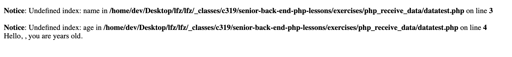
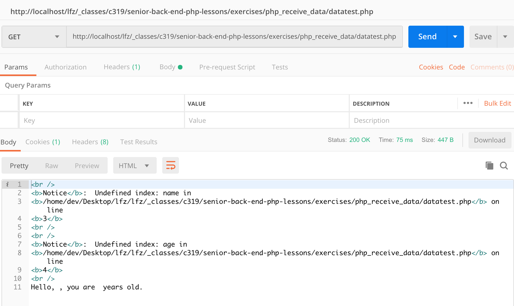
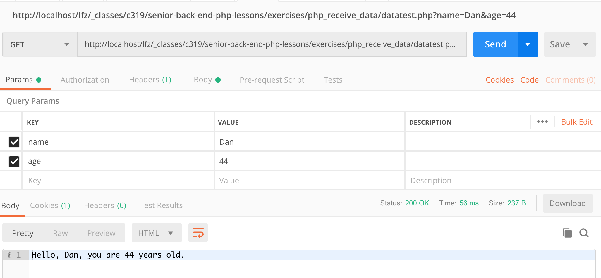
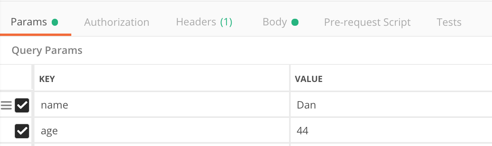
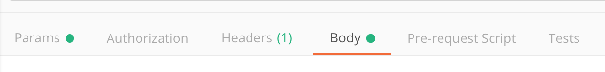
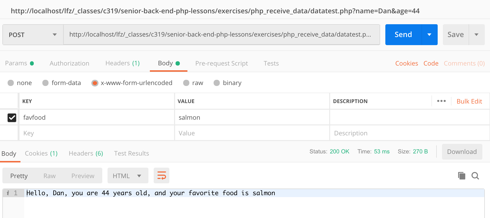
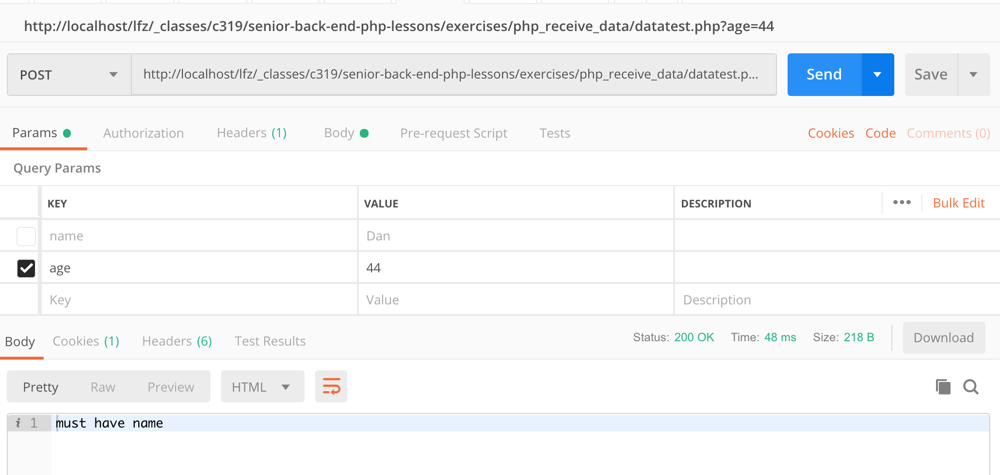
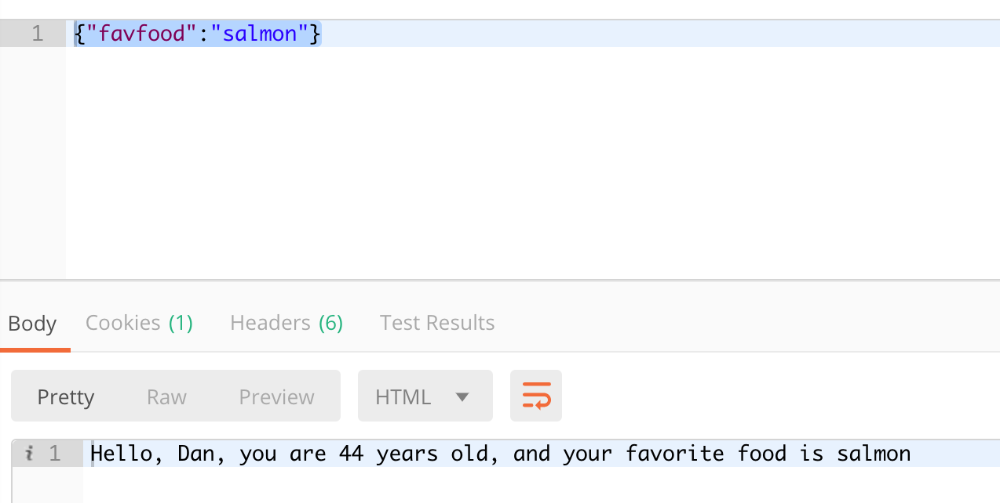

# PHP php receiving data

Introduction to PHP code - php receiving data

### Before you begin

Check out a new branch from master for this exercise.  Then navigate to exercises/php_receiving_data directory in your terminal.
#### make a new branch named the same thing as the folder

### Exercise

1. make a file, datatest.php
1. Read about the [**$_GET superglobal**](https://www.php.net/manual/en/reserved.variables.get.php)
    * the $_GET superglobal is a parse of the [**query string variables**](https://launchschool.com/books/http/read/what_is_a_url#querystringsparameters)
    * More learning - you'll want to read about [**superglobals**](https://www.php.net/manual/en/language.variables.superglobals.php) in general.  In particular these will be useful later
        * GET: all query variables during this request
        * POST: all url-encoded body variables during this request
        * SERVER: a variety of useful pieces of info about the request and server during this request
        * COOKIES: any cookies sent to the server by this client during this request
        * FILES: metadata for any files uploaded in this request
1. superglobals are arrays.  Use the $_GET to get the key name and the key age.  Put them into a variable named $name, and the variable $age
1. make a variable sentence, and put together this sentence:
    * "Hello, NAME, you are AGE years old.
1. use postman, hit your endpoint.  It will give you several warnings and a sentence with empty spots.  That's because we sent nothing to it in the query string
    * browser: 
    * postman: 
1. in postman, in the url, add the following to the end of the URL:
    * "?name=&lt;your name&gt;&age=&lt;your age&gt;"
    * for example: "?name=Dan&age=44"
    * so the end of the url would be something like "datatest.php?name=Dan&age=44"
1. Click on "SEND" again, notice the response.
    * 
1. Click on the params button, you'll see that your name and age key/value pairs are also there.  Postman does this to make it easier on you.
    * 
1. We're going to now use the $_POST superglobal.
1. in your datatest.php, right below your variables from above, right below your $_GET variables
1. access the $_POST key "favfood".
1. add that to your sentence.  So now it should say "Hello, NAME, you are AGE years old, and your favorite food is FAVFOOD"
    * replace the cap words with their appropriate variables
1, in Postman, Where it says "GET", click on it and change it to POST
    * 
1. look for the label "body" and click it
    * 
1. look for the label "x-www-form-urlencoded"
1. in the key/value pairs, add "favfood", and your favfood
1. click SEND on postman
1. you should now have a full sentence
    * 
1. if you remove one of the get params, you'll notice it breaks a bit.  Let's test to see if the parameter is there.
1. above your test for your $_GET variable, put an if statement
1. in the conditional, use the function [**empty**](https://www.php.net/manual/en/function.empty.php).  Test if the $_GET['name'] superglobal exists
    * empty returns true if the variable in question
        * doesn't exist
        * or is empty (null, 0, empty string, etc)
    * [**isset**](https://www.php.net/manual/en/function.isset.php) tests for existence, like JS typeof
1. if the variable is empty, print the message "must have 
name" and exit
1. disable / clear the name param, and see the error message appears
    * 
1. make a pull request for your current status before moving onto the next part
1. sometimes data is sent to PHP via json.  Axios, Fetch, even AJAX can send json data instead of url-encoded data.  By default, currently, PHP doesn't have the ability to parse it from the body.  So we're going to draw it out of the raw body.
1. use [`file_get_contents()`](https://www.php.net/manual/en/function.file-get-contents.php), but the file will be [`"php://input"`](https://www.php.net/manual/en/wrappers.php.php). This is the raw body input, which happens to be a JSON string.
1. put the result of file_get_contents into a variable called $json_input
1. the contents of $input will now be a json encoded string.  Use json_decode to convert it to an object/array.  
    * first param, give it json_input
    * second param, give it true
    * read more about [**json_decode**](https://www.php.net/manual/en/function.json-decode.php).  You miiiight be asked about that second param, right?
1. $input now has an associative array in it, with favfood inside it.  Use this to supply your $favfood variable that formerly came from $_POST
1. in Postman, under body, instead of "x-www-form-urlencoded", change it to "raw".  This will literally take whatever characters you put in the box below
    * 
1. in the box below, put this json with your fav food:
```
{"favfood":"salmon"}
```
1. test your endpoint
    * 
1. make a pull request with the current version.  Don't forget to include your screen shots.